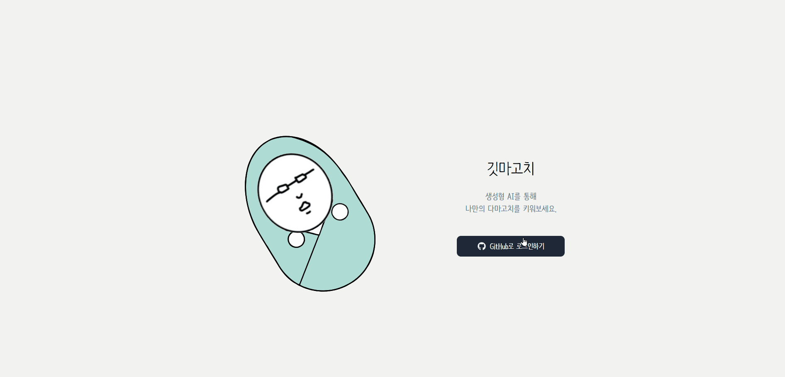
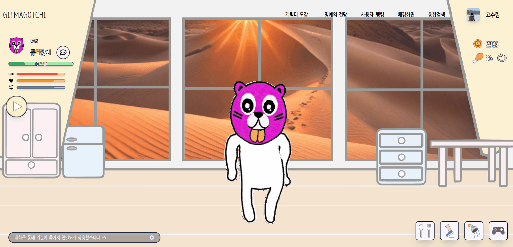

# Git Commit으로 캐릭터 키우기 프로젝트 'Gitmagotchi'
## AWS 서버리스 아키텍처 기반 GEN-AI Web APP

<!-- 사진 -->

# 목차

### [**1. 서비스 개요**](#📌-서비스-개요)

### [**2. 기획 배경**](#☁-기획-배경)

### [**3. 서비스 기능 소개**](#🏛-서비스-기능-소개)

### [**4. 팀 구성**](#👨🏻‍💻-팀-구성)

### [**5. 기술 스택**](#🛠️-기술-스택)

### [**6. 아키텍처**](#🎨-아키텍처)

### [**7. 주요기능**](#💡-주요기능)

### [**8. 시연영상**](#🎬-시연-영상)

### [**9. UCC**](#ucc)

### [**프로젝트 산출물**](#📄-프로젝트-산출물)

# 📌 서비스 개요

- 개발 기간 : 2024.04.08 ~ 2024.05.20 (6주)
- 개요 : 개발자들의 깃 커밋을 독려하기 위한 프로젝트
- 타겟 : 개발자

# ☁ 기획 배경

- 

# 🏛 서비스 기능 소개

-
-

# 👨🏻‍💻팀 구성

| [송윤재](https://github.com/Song-YoonJae)                                                       | [고수림](https://github.com/sulim0314)                                                      | [권송아](https://github.com/songahh)                                                     | [김희연](https://github.com/heeyeon3050)                                                   | [이유로](https://github.com/rheeeuro)                                                     |                                                  |
| ------------------------------------------------------------------------------------------ | ----------------------------------------------------------------------------------------- | ------------------------------------------------------------------------------------------ | ------------------------------------------------------------------------------------------ | ----------------------------------------------------------------------------------------- | ----------------------------------------------------------------------------------------- |
|  |  |  |  |  | |
| 팀장, 백엔드                                                                               | 백엔드, 서기                                                                                    | 백엔드, AI                                                                             | 백엔드, PM                                                                                | 프론트엔드                                                                                    |                                                                                    |
| 1111111                              | 222222      | 3333333                                        | 444444                                    | 5555555                                            |  |

 

# 🛠️ 기술 스택

**Front**
 

**Back**
 

**Cooperation**
 

 

# 🎨 아키텍처

 

# 💡 주요기능

### 1. 사용자 인증

### 2. 커밋 기반 밥 짓기

### 3. 캐릭터 얼굴 AI 생성

### 4. 배경화면 AI 생성

### 5. 채팅 및 감정분석

### 6. 캐릭터 모션

### 7. 캐릭터 도감

### 8. 캐릭터 경험치

### 9. 캐릭터 스탯

### 10. 명예의 전당 오르기

### 11. 명예의 전당

### 12. 사용자 랭킹

### 13. 통합검색

 

# 🎬 UCC
https://www.youtube.com/watch?v=w9rcBkjkh_k

 

# 📄 프로젝트 산출물

### [1. 요구사항 명세서](https://chocolate-mint-5ac.notion.site/2f50c6e01a2f4712a7bdd678e81c9b08?pvs=4)

### [2. ERD]

### [3. API 명세서](https://chocolate-mint-5ac.notion.site/API-2e3285f3edd247fbae97d6e0d96f6108?pvs=4)

 

# 참고

### 노션
